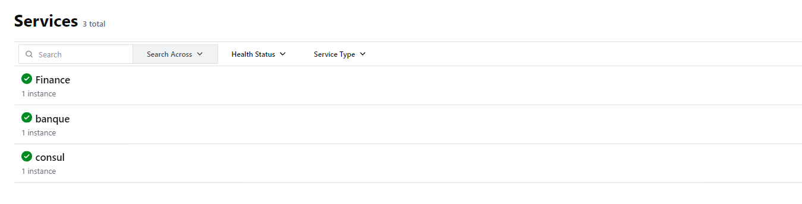
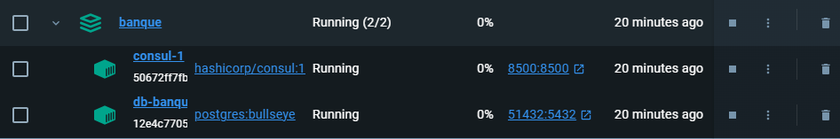
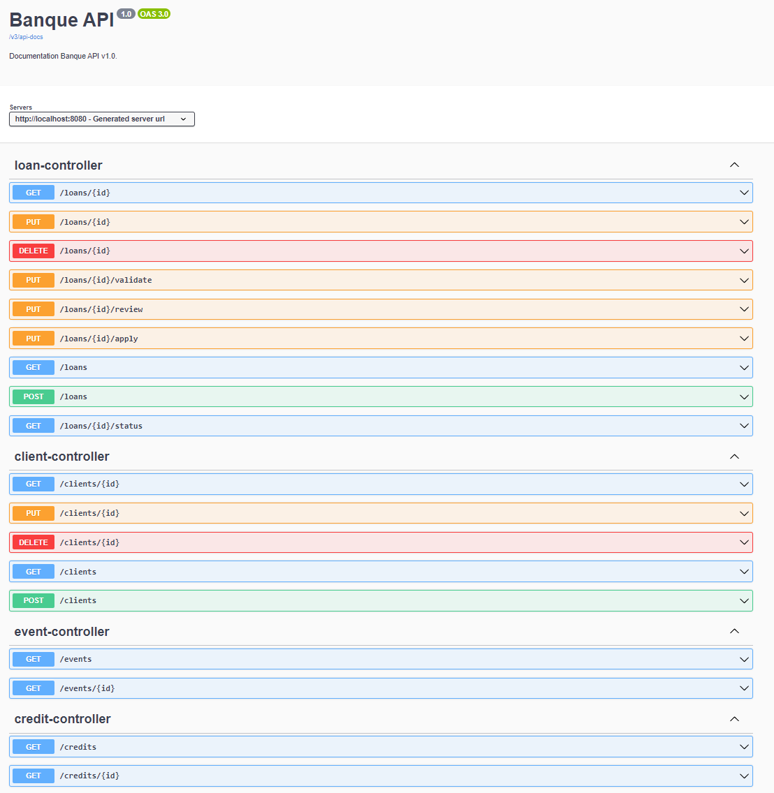

# Projet API - M2 MIAGE SID

Ce projet a été réalisé dans le cadre du cours d'API en M2 MIAGE SID à l'IDMC de Nancy.
Il met en place deux services, un service banque et un autre finance publique.
Le projet a été réalisé avec Spring Boot et HATEOAS.

## Lancement du projet
Pour lancer le projet, il suffit de lancer la commande suivante à la racine du projet "banque":
```bash
docker-compose up -d
```
Ensuite, il faut lancer l'application banque via la classe BanqueApplication.java ainsi que l'application finance via la classe FinanceApplication.java.
Enfin, il faut lancer la commande suivante à la racine du projet "finance":

Au lancement du projet, la base de données est initialisée avec des données contenu dans le fichier data.sql.

## Liens utiles pour le projet
- SWAGGER : http://localhost:8080/swagger-ui/index.html
- Consul : http://localhost:8500

## API RESTFUL
### Banque
C'est le plus gros service du projet. Il permet de gérer des clients et leurs demandes de crédit.
Il faut dans un premier temps créer un client pour pouvoir créer une demande de crédit.
Ensuite, il est possible de créer une demande de crédit pour un client.
Le crédits va être vérifiés par un conseiller ainsi qu'un directeur crédit avant d'être validé ou refusé.
Pour finir, une instance de crédit est créée pour le client. 

Il est possible de suivre tout les evenements de la demande de crédit.

Le service est lancé sur le port 8080.

#### Clients
- GET /clients : Récupérer tout les clients
- GET /clients/{id} : Récupérer un client
- POST /clients : Créer un client
- PUT /clients/{id} : Mettre à jour un client
- DELETE /clients/{id} : Supprimer un client

#### Demandes de crédit
- GET /loans : Récupérer tout les demandes de crédit
- GET /loans/{id} : Récupérer une demande de crédit
- POST /loans : Créer une demande de crédit
- PUT /loans/{id} : Mettre à jour une demande de crédit
- DELETE /loans/{id} : Supprimer une demande de crédit
- GET /loans/{id}/status : Récupérer le status d'une demande de crédit
- PUT /loans/{id}/apply : Passer une demande de crédit à l'étape de l'étude
- PUT /loans/{id}/review : Passer une demande de crédit à l'étape de la validation
- PUT /loans/{id}/validate : Valider une demande de crédit

#### Crédits
- GET /credits : Récupérer tout les crédits
- GET /credits/{id} : Récupérer un crédit

 #### Evenements
- GET /events : Récupérer tout les evenements
- GET /events/{id} : Récupérer tous les evenements d'une demande de crédit

### Finance
Ce service permet de faire valider par les finances publiques la capacité du client a contracté un prêt en fonction de son revenu.

Le service est lancé sur le port 8180.

- GET /finance/{income} : Valide la capacité du client à contracter un prêt

### Circuit breaker
Le projet utilise un circuit breaker pour gérer les appels entre les services banque et finance.
Cela permet de gérer les erreurs lors de l'appel d'un service surtout lorsqu'il est en panne. On peut facilement attraper l'erreur pour la gérer.
J'ai utilisé Resilience4j pour gérer le circuit breaker. Il est configuré pour réessayer 2 fois avant de renvoyer une erreur en attendant 200ms entre chaque essai.

```java
@PutMapping("/{id}/review")
@CircuitBreaker(name = "finance", fallbackMethod = "reviewLoanFallback")
@Retry(name = "finance")
public ResponseEntity<EntityModel<LoanApplication>> reviewLoan(@PathVariable("id") Long id, @RequestParam String decision, @RequestParam Long advisorId) {
    try {
        Worker advisor = workerRepository.findById(advisorId).orElseThrow(() -> new NoSuchElementException("Advisor not found"));
        if (advisor.getJob() != BankJob.ADVISOR) {
            throw new IllegalArgumentException("Worker is not an advisor");
        }

        String url = "http://localhost:8180/finance/" + loanService.getLoan(id).getClient().getSalary3years();

        // Appel API Finance
        String responseFinance = restTemplate.getForObject(url, String.class);

        if (responseFinance.equals("You are not eligible for a loan")) {
            //traitement à faire
            throw new IllegalArgumentException("Client is not eligible for a loan");
        } else {
            LoanApplication loanApplication = loanService.reviewLoan(id, decision, advisor);
            eventService.createEvent(loanApplication);
            EntityModel<LoanApplication> loanModel = loanAssembler.toModel(loanApplication);
            return ResponseEntity.ok(loanModel);
        }
    } catch (NoSuchElementException e) {
        return ResponseEntity.notFound().build();
    } catch  (IllegalArgumentException e) {
        return ResponseEntity.badRequest().build();
    }
}

public ResponseEntity<String> reviewLoanFallback(RuntimeException re) {
    return ResponseEntity.status(503).body("Service unavailable");
}
```

## HATEOAS
Le projet utilise HATEOAS pour permettre de naviguer dans les ressources de l'API.
Cela permet dans notre cas de montrer les routes disponibles après chaque action effectuée par un utilisateur.

Le dossier assembler contient les classes permettant de gérer les liens HATEOAS pour chaque ressource.

Voici un exemple sur la ressource loans/{id}/apply :
```json
{
  "id": 3,
  "createdAt": "2024-03-03",
  "updatedAt": "2024-03-07T09:15:00",
  "amount": 60000.0,
  "duration": 60,
  "rate": 2.95,
  "status": "ETUDE",
  "reviewedBy": null,
  "validateBy": null,
  "client": {
    "id": 3,
    "firstname": "Pierre",
    "lastname": "Durand",
    "email": "pierre.durand@example.com",
    "address": "789 Boulevard des Étoiles",
    "job": "Médecin",
    "salary3years": 80000.0
  },
  "_links": {
    "self": {
      "href": "http://localhost:8080/loans/3"
    },
    "collection": {
      "href": "http://localhost:8080/loans"
    },
    "events": {
      "href": "http://localhost:8080/events/3"
    },
    "review": {
      "href": "http://localhost:8080/loans/3/review?decision={decision}&advisorId={advisorId}",
      "templated": true
    }
  }
}
```

## Consul
Le projet utilise Consul pour la découverte de service. Il permet de savoir si un service est en ligne ou non.



## Docker
Pour gérer la base de données du service banque, nous utilisons un container docker avec une image de PostgreSQL.
Nous utilisons également un container docker pour lancer Consul.



## Swagger
Le projet utilise Swagger pour documenter l'API RESTFUL. Il permet de voir les routes disponibles et les paramètres à envoyer.
Cela permet de tester l'API directement depuis le navigateur. Ainsi que de voir les réponses attendues.
Dans un autre contexte, cela permet de voir les routes disponibles pour un client qui voudrait utiliser l'API.



## Auteur
L'HUILLIER Thomas - M2 MIAGE SID - IDMC Nancy
Année universitaire 2023-2024
